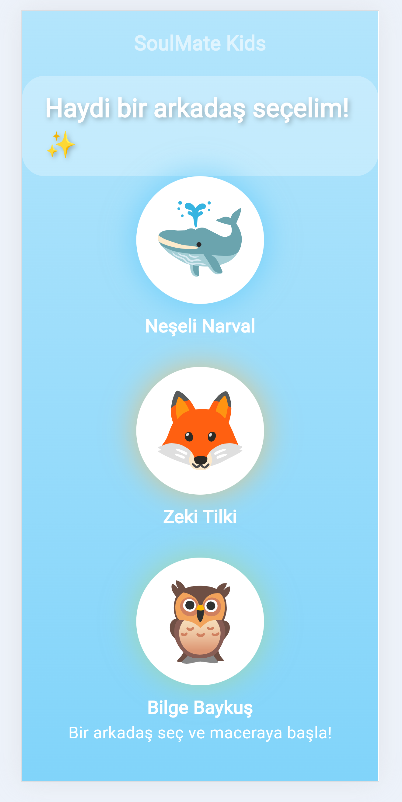
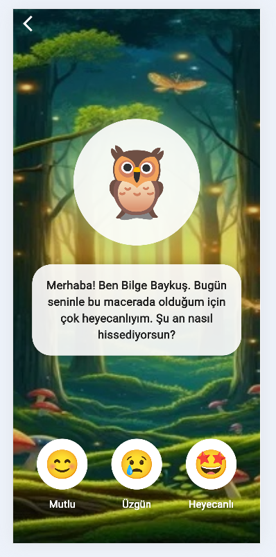
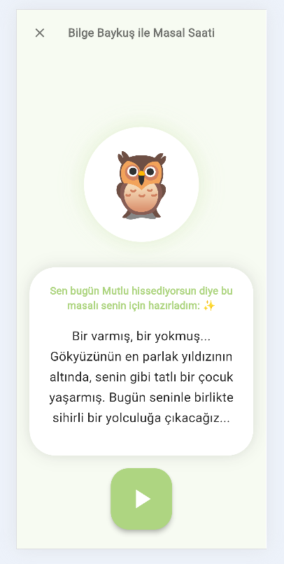

# 🌟 SoulMate Kids - Yapay Zeka Destekli Masal Arkadaşı

SoulMate Kids, 0-7 yaş grubu çocukların duygusal gelişimlerini desteklemek amacıyla geliştirilmiş, interaktif ve kişiselleştirilmiş bir masal anlatma uygulamasıdır. Çocuklar seçtikleri pofuduk karakterler ve o anki duyguları aracılığıyla kendilerine özel masallar dinleyebilirler.

## 📸 Uygulama Ekran Görüntüleri

Uygulamamızın temel akışı ve kullanıcı arayüzleri aşağıda sunulmuştur:

### 1. Karakter Seçimi Ekranı
Çocuğun masal yolculuğuna eşlik edecek olan pofuduk arkadaşını (Tilki, Narval vb.) seçtiği giriş ekranıdır.


### 2. Duygu Belirleme Ekranı
Çocuğun o günkü ruh halini (Mutlu, Üzgün, Heyecanlı) seçerek masalın içeriğini şekillendirdiği interaktif ekrandır.


### 3. Masal Dünyası
Yapay zeka (AI) tarafından oluşturulan, seçilen karaktere ve duyguya özel masalın sunulduğu ana ekrandır.


---

## 🛠️ Teknik Özellikler

- **Frontend:** Flutter ile geliştirilmiş, Hero animasyonları ve mikro-etkileşimlerle zenginleştirilmiş kullanıcı dostu arayüz.
- **Backend:** FastAPI (Python) kullanılarak oluşturulan asenkron API mimarisi.
- **Mimari:** Kodun sürdürülebilirliği için Model-View-Component yapısı tercih edilmiştir.

## 🚀 Çalıştırma Talimatları

### Backend'i Başlatma:
```bash
cd backend
python -m uvicorn main:app --reload